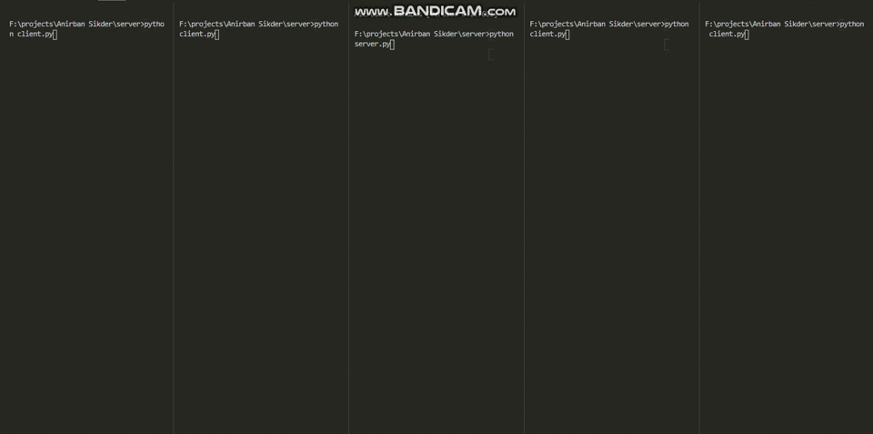

# Task

Making A CLI group chat interface with addded Encryption

#threading

The threading module provided with Python includes a simple-to-implement locking mechanism that allows you to synchronize threads.

## Installation

```bash
pip install threading
```

## Usage

```python
import threading
thread = threading.Thread(target = function) # this helps the Function "function" run along with the main function.
thread.start() #  Starting The thread

# Refer To The Original Documentation for more
```

# My Approach

So , I had this idea while working on Subtask 2 of Task 2 of creating a group chat application where multiple people can connect . I also implemented a very simple encryption *(Caesar cipher)* so that only the recievers and senders can see the actual message (with the key) !! 
My code has two files one server and one client !!
Work of my server is to receive a message from one client and send (*broadcast*) the message to other clients so that they can see the message as well . For receiving and accepting connections I used the concept of thread . Also I added a part where the clients can enter there name which would be displayed beside their name , just as whats app !! A message would be popped in server if a person disconnects !!
In The client part I used thread to recieve the message !! And Here after taking input from the user I just modify it (*encrypt*) and send it to the server for being broadcasted to other members . After receiving the message I again modify(*decrypt*) the message to display in the chat box !!
For time issues I could only implement the command line version of it , I am thinking of the GUI version and also trying for a stronger encryption (RSA encryption maybe) !


# Output Of My Programme


