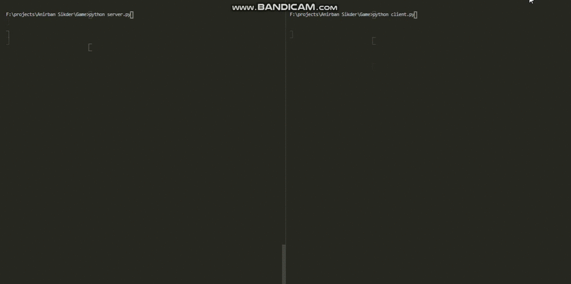

# Task

Making A multiplayer GUI TIC-Tac-Toe

# Pygame

Pygame is a cross-platform set of Python modules designed for writing video games. It includes computer graphics and sound libraries designed to be used with the Python programming language.

## Installation

```bash
pip install pygame
```

## Usage

```python
import pygame
pygame.init() # Initializes the game window
pygame.display.set_mode((width,height)) # Builds The infrastructure
pygame.display.set_caption("Caption") #sets the caption

# Refer To The Original Documentation for more
```

# My Approach

I used The pygame to give the tic tac toe a visual display ! So I Build a server file and a client file where I build the game and used sockets to send and recieve data .
But A problem I faced was that the game was crashing while recieving data . So to tackle this I used Thread to run the _recv_data()_ function run simultaneously with the main function so that is doesn't interrupt my flow of gameplay.

# Output Of My Programme


