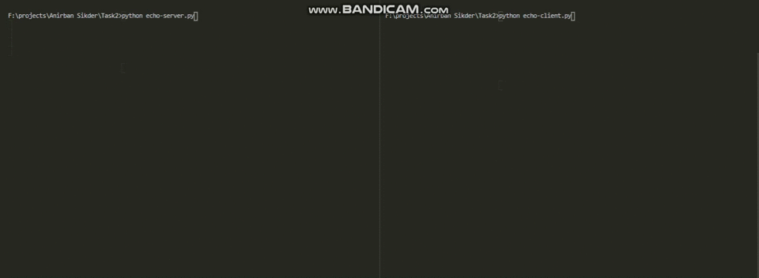

# Task

Now that you’ve seen an overview of the sockets , let’s create our first client and server. We’ll begin with a simple implementation. The server will simply echo whatever it receives back to the client.

# My Approach

It is Nearly Similar To Our First task. All I did in server file was to send back the data that we are recieving. One Important Thing to be Noted is when I send An empty string it considers as disconnect packet. So we Just Check If the string is empty We send '\x00' to make sure our code works well.

## Sample Video Solution :

.
