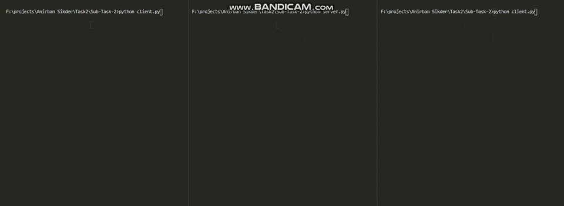

# Task

In this task basically keep the socket connection part inside your main and create a threaded function which create a thread whenver a new client joins and keeps running until client exits.

# My Approach

The Entire part Of The Code Remains Same As Subtask 1 . The Only Change is I created A new **Thread** Every Time A new Client Connects.

## Sample Video Solution :

.
