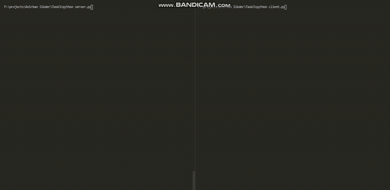

# Task

Creating A CLI Tic-Tac-Toe game using Sockets , so that multiplayers(2) can play it !

# My Approach

The Basic Approach for checking a Tic-Tac-Toe is that if either any row or any column or any diagonal has the same string and the string is not empty , then the last player to make the move Wins The Game !! If neither of the condition is made Even After 9 moves the game ends in a draw .
So I start With server and send it's input to client and vice versa till the game Ends .

# Video Solution

Thank You Team [@lugnitdgp](https://github.com/lugnitdgp) For Guiding ME !
