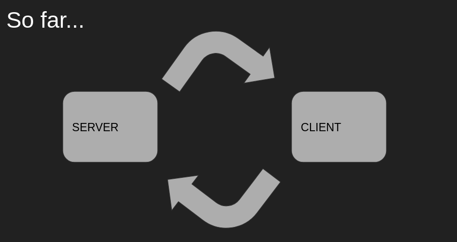
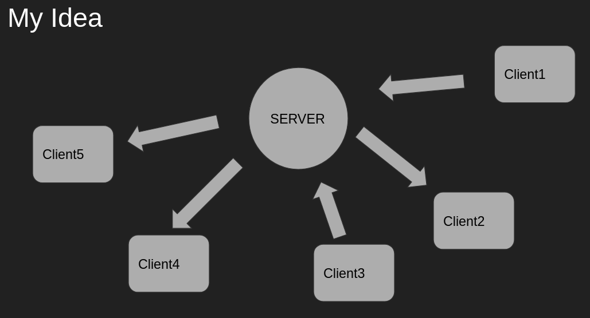
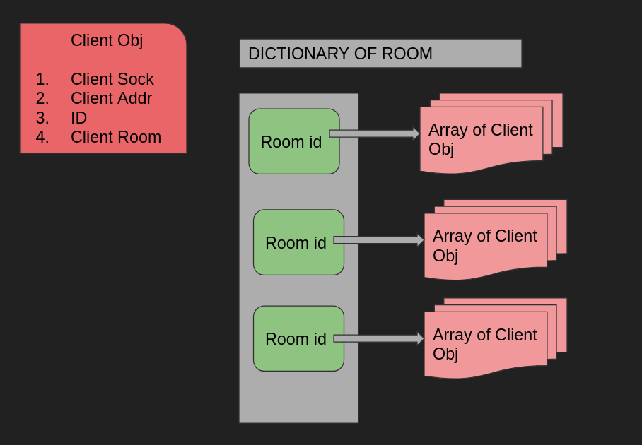
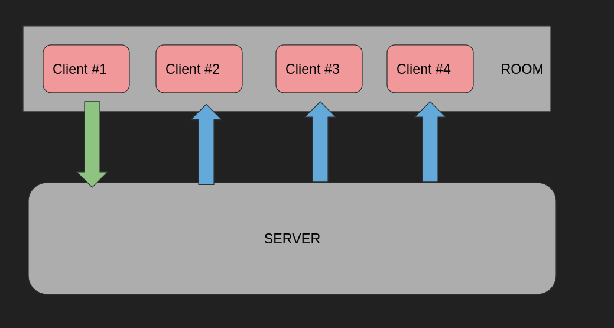

## Open Innovation

### My Idea:

> Implementing rooms in sockets. So, whenever a client will join they can create a new room or join any existing room. And chat and interact with those in that room.

### My Projects:

I implemented my idea in two parts:
1. **Chat Room :** As the name suggests the user can join a room or create a new one, and chat with those in that room. 
2. **TicTacToe :** Now the user can not just enter the rooms but can also play tictactoe, but here the limit is 2 clients per room. 

### Basic Understanding

So far, we restricted ourselves to two clients(one of which acted as a server)

My idea was to implement one single server in the center, and clients that will connect to the server. The Clients can interact with each other thorugh the server. 

Now in the image above you can see if we can put Client 1 and 2 in a "room" that means what ever interaction they have will not be leaked to the others. Same goes for 3 , 4, 5. 

So, in the chat app what one can do run the [client script](Chat_Room/client.py) [ But we need to make sure the [server script](Chat_Room/server.py) is running ] and they can create a new room and join an existing room. Then they can talk to others in that room. Now how to implement this room. 

In the server we maintain a dictionary of rooms, where the keys will be the room id and it will store an array/list of "Client" Objs. Now what will those client objects contain? you can see it is mentioned in the image above
1. ID
2. Room
3. Socket
4. Address

**P.S :** For the id I used the uuid module of python.

So whenever someone in the room sends a message, the server then forwards the message to all the other clients in the room other than the client who sent it. 

One thing to keep in mind while making the chat room is the use of threading for listening on the client side, 

### TicTacToe:

*so far I could only do till the CLI version, but it can be easily extended to the pygame interface*

In this case, the clients are assigned an ID. The person who joins first is the player 1.

**TODO: A choice to the client whether they want to be X or O**

Now for the person X the game follows this way
1. play the move
2. display board
3. recv opponent's move
4. display board

For the person O it will change a bit
1. recv opponent's move
2. display board
3. play the move
4. display board

For a detailed video explanation I made a video on this: https://drive.google.com/drive/folders/10i_KUy-7fK7Q_3g2B_CJgCBsy8j4YxeK?usp=sharing

