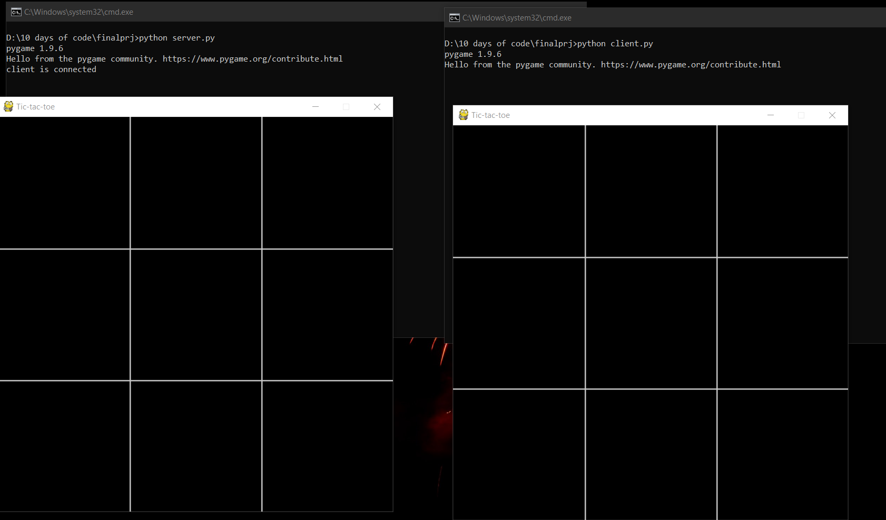
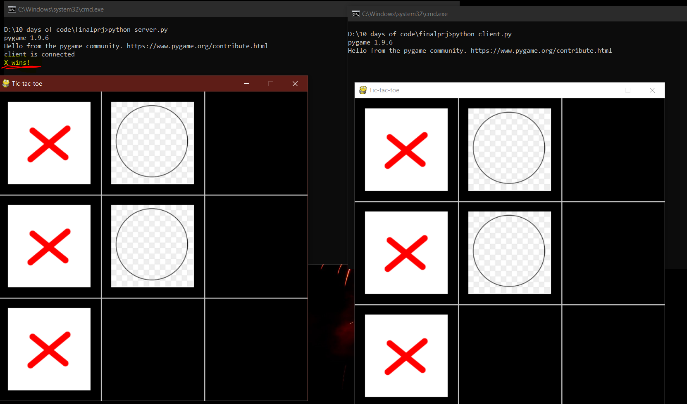

# Make sure you have pygame installed . Else run ```pip install pygame``` in your terminal

Open ```server.bat``` and ```client.bat``` and play the game. 
Else open your terminal and run 
1. ```python server.py```
2. ```python client.py```

#Some sample of the game




