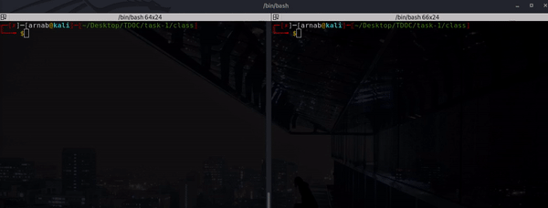

## Task-1
Date: 03-Oct-20

### Problem Statement

**Ping-Pong Clients**

Make 2 client files which send data to each other using two different ports. One should send data (ex. "PING") and then recieve some data (ex. "PONG").
While the other should first receive data and then send an appropriate response. 

First initialize a socket connection and connect it to different network interfaces, for testing you can use the same hostname: localhost and different ports using socket.gethostname(). Sending data is done using sendto() method. It accepts as arguments, the data and the network interface address as a tuple containing hostname and port number. Receiving data is done using the recv() function; it needs a buffsize argument to denote the size of the data packet to be received.
*P.S* Also do not forget to encode and decode the data.

### My Approach

Having a basic knowledge of sockets will suffice for this task. The **@lugnitdgp** team shared some resources (I will link them at the bottom).

I made two files. `client1.py` and `client2.py`. Client1 will act like a server. So in [client1.py](client1.py), I made a class for Server(I know it wasn't necessary but yeah clean code is always preferred <3 ) and it had the basic methods as described here: 

| METHODS | ARGS | RETURNS | DESCRIPTION |
|---|---|---|---|
|`init()`| `ADDR, DISCON_MSG='QUIT'` | Server Socket | create a socket object and start listening on ADDR and declare an disconnect token|
|accept_client() | none | `conn, addr` | accept a new client connection and returns the client socket and its address|
|recv_message() | `conn, CHUNKS=1024, FORMAT='utf-8'` | data recevied as `String` |receives the message from the client socket `conn` in chunks of `CHUNKS` and decodes it to `FORMAT`|
|send_resp() | `conn, RESPONSE='PONG', FORMAT='utf-8'` | none | sends the encoded response to the client socket `conn`, be default it os `PONG`. Follows the encoding specified in params|

Then in the main body the client1.py I crated a socket object and follwed the usual order of methods. 
1. `socket()`
2. `bind()`
3. `listen()`
4. `accept()`
   

Also I have added a token `DISCON_MSG` which will indicate when to close the connection.

For [client2.py](./client2.py) it is a very basic client script. Again I made a client Class, which has three methods only. 

|METHODS|ARGS|DESCRIPTION
|---|---|---|
|__init__()|`ADDR, DISCON_MSG='Q'` | Initialises client socket and connects to `ADDR` |
| send_message()|` message, FORMAT='utf-8'` | send the encoded message to the connected server socket|
|recv_resp()| `CHUNKS=1024, FORMAT='utf-8'`| receive the response from the server (aka `client1` ) in chunks of `CHUNKS` and decodes it in `FORMAT` and returns it |

### Sample

.

### Resources

1. https://docs.python.org/3/library/socket.html
2. https://drive.google.com/file/d/17MDkLEWeBajEyqu-LzXZOhgxW9ZIUqv1/view?usp=sharing
3. https://drive.google.com/file/d/1jaNf0lfPFdChh5KhM1nAlCHPgy6wTrnQ/view?usp=sharing

Thanks to [@lugnitdgp](https://github.com/lugnitdgp) for the mentoring and guiding