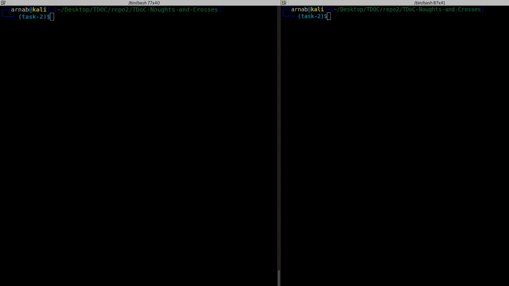
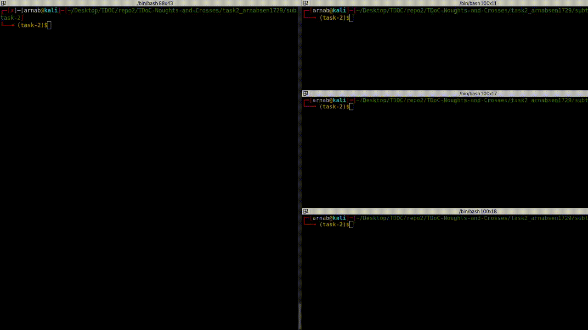

## Task-2
Date: 04-Oct-20

### Problem Statement

**Subtask-1**

Let’s create our first client and server. We’ll begin with a simple implementation. The server will simply echo
whatever it receives back to the client.

**Subtask-2**

Now in this part, the server will be handling more than 1 client simultaneously, which can be achieved by threading.


### My Approach

Subtask-1 is fairly simple, almost similar to the first one except the fact that this time the server will echo whatever the client sends. 

Subtask-2 is an extension of the subtask-1. For this subtask a basic knowledge of threading is required. The mentors provided us a guide(link provided in the bottom). Now the main reason why threading is required is because when you handle one client you are recieving and sending data continuously which is basically an infinite loop. Now while this is going, normally the program will not be able to accept other clients, since its stuck in the loop. So, each connection to a client is threaded, and those thread will run simultaneously. Basically, because of one client(a thread) the other clients don't have to wait. That is the main reason why we need threads for this problem. Now there are various ways to handle threads. One of the easiest way is

```python
t = threading.Thread(target=myFunction, [args=(arg1, arg2, ...)])
t.start()
```

We can also use `ThreadPoolExecutor`, and it’s part of the standard library in `concurrent.futures`

Now, all this has to be done in the server side. The client side, remains the same. 

**P.S** There is a `test.py` file in subtask-2 folder, it is another client script but sends the same message in an infinite loop. So, I ran the server script then this test script and after that a normal client script. So while the test script was sending the same thing over and over again, I typed some messages from the client script and the server echoed it back. Thus, threading worked like a charm.
### Sample

Subtask-1



Subtask-2




### Resources

1. [Task 2 Porblem Statement and guide](https://drive.google.com/file/d/1qwJGfjYzLl68RaYt_hzgmEp8DJxYz7SY/view)
2. [RealPython: Threading ](https://realpython.com/intro-to-python-threading/)

Thanks to [@lugnitdgp](https://github.com/lugnitdgp) for their awesome guidance <3 