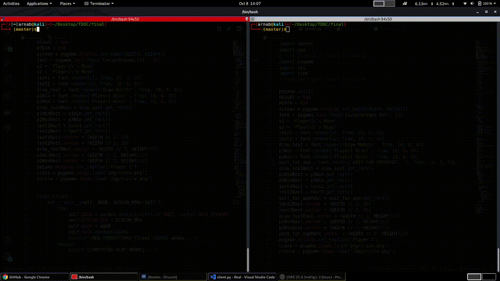

## Final Task

Our final task was to build the game interface using pygame and make it multiplayer with sockets. 

One of the best thing about pygame is their docs, also pygame is very easy to use aswell. We make a function that will display the grid of TicTacToe and call that function every time any player makes a move. But how to integrate server and client? 

**Server Side**

First create a basic socket, bind it to a port and listen to it. Its the usual stuffs we have been doing for all the previous tasks. Next would be to accept a client. This is when the game will start. Initially once you run the server.py the pygame window appears but its all black because the client hasn't yet joined. So to avoid that once the server is initialised display a text '`WAIT FOR OPPONENT`. Check line number 324-327 in [server.py](./server.py). Now it will look better. Now when the client joins, the game starts in my case I call the `mainGame()` function. 

**Client Side** 

Initialising the client side is easier all we need to do is connect to that socket and the game will start

**Game Flow**

Every game has some states. Be it something as simple as TicTacToe or something like PUBG. And to make multiplayer games work smoothly  the state is shared because the lesser amount of info that is shared, better would be the performance. In our case what are the states.
1. `who` -> who is going to play the curr move
2. `board` -> The position of the crosses and circles played so far. 
3. `moves` -> number of moves played so far

I used these three states. And what info do we need to send from server to client and vice versa ? Just the move played by the other player would suffice. So this is how it works. 

First we will check if this is my move. If it is, it will listen to the `click events`. From the click coordinates we can decide on which index the player played the move. And accordingly change the board. At the same time we will send this move through the sockets. Else if this is not my move, all I would do is simply listen from socket for the other players move. In either case we will update the game and display it. 

Here is the final look

I am attaching the resources below like always. Most importantly I would love to thank the team of [@lunitdgp](https://github.com/lugnitdgp) for this awesome opportunity. And special thanks to the mentors of @NoughtsAndCrosses :

- [@Phantsure](https://github.com/Phantsure)
- [@ЕЯЯОЯ](https://github.com/Error-200)
- [@ramiz07](https://github.com/deadlycoder07)
- [@kumanik](https://github.com/kumanik5661)

They were constantly helping us solving our issues, managed to host regular sessions to clear our doubts. 

### Ref:
1. https://drive.google.com/file/d/183vlpHd2tKGp9nfLGCQ4DUPPfuSH_a8c/view?usp=sharing
